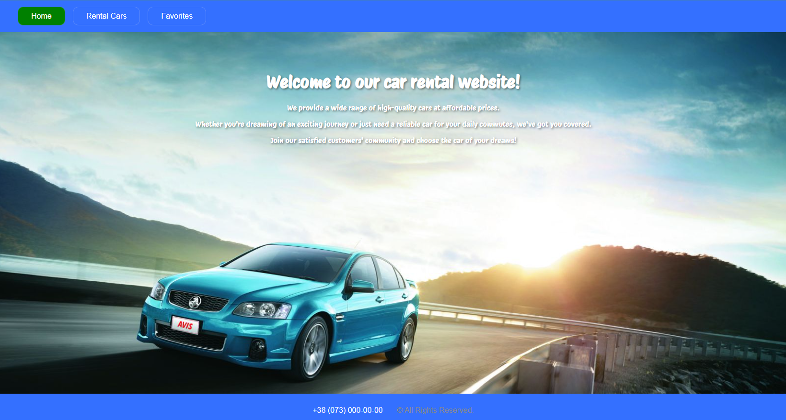
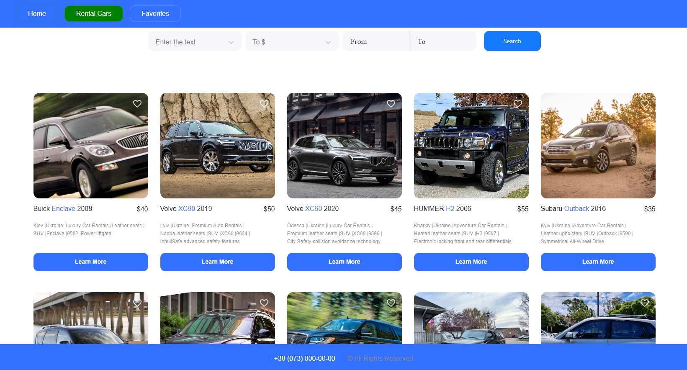
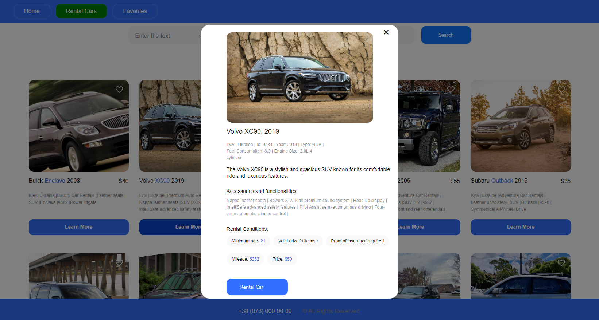
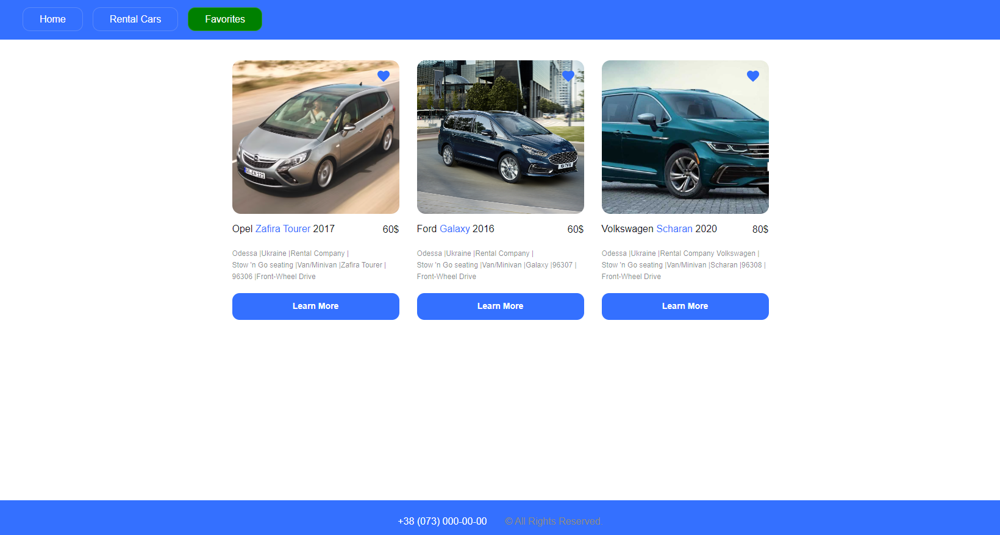

# Car Rental Application

This project is a web application for a car rental company operating in Ukraine. The application allows users to browse through a catalog of available cars, filter them based on various criteria, view detailed information about each car, and add their favorite cars to a favorites list. The application also provides a contact option to connect with the company for car rental inquiries.

## Features

✅ 1. Home Page: Provides an overview of the services offered by the company. 

✅ 2. Catalog Page: Displays a catalog of cars available for rent, with filtering options by car brand, hourly rental price, and mileage.

✅ 3. Favorites Page: Shows a list of advertisements added by the user to their favorites.

🧑‍💻 4. Responsive Design: The application is designed to be responsive and compatible with different screen sizes.

## Technical Details

✅ - Frontend Framework: **TypeScript**
 
✅ - State Management: **Redux**

✅ - Routing: **React Router**

✅ - Styling: **Styled Components**

✅ - API Service: **Utilizes MockAPI for backend services**

✅ - HTTP Client: **Axios for making HTTP requests**

🧑‍💻 - Pagination: **Implemented on the backend to serve 12 advertisements per page**

✅ - Validation: **Ensures valid and semantic HTML**

✅ - Deployment: **Deployed on GitHub Pages**

## How to Run
To run this application locally, follow these steps:

1. Clone this repository to your local machine.

2. Install dependencies using `npm install`.

3. Start the development server using `npm start`.

### Screenshots

### Autor 

- [Vladyslav Svitlychnyi]("https://github.com/Svitly4nyi-Vla2yslav")

### Acknowledgments

Special thanks to MockAPI for providing backend services for this project.

### License

This project is licensed under the MIT License - see the [LICENSE.md](./LICENSE.md) file for details.
